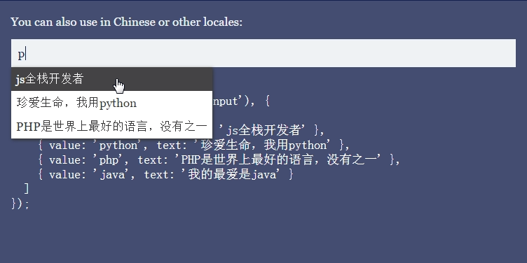

# horse.js

> **< 3Kb**. autocomplete component of pure javascript.

includes every sane browser and **IE7+**.

[](https://travis-ci.org/hustcc/horse.js) [](https://www.npmjs.com/package/horse.js) [](https://www.npmjs.com/package/horse.js) [](https://www.npmjs.com/package/horse.js)


# Features

- Small and focused, **2.97kb**, smaller after gzip
- Natural keyboard navigation
- Fuzzy searching
- Supports `<input>` elements


# Install

Just link to you website use `link` and `script`.

```
<link href="dist/horse.css" rel="stylesheet" type="text/css">
<script src="dist/horse.js"></script>
```

or **`npm install horse.js`**, then`require`: 

```html
import horse from 'horse.js';

// or

var horse = require("horse.js");
```


# Demo!

You can see a [live demo here](http://hustcc.github.io/horse.js/).

or `USAGE` in website: [http://www.aTool.org](http://www.atool.org/)




# Example

```javascript
horse(document.querySelector('input'), {
  suggestions: [
    { value: 'banana', text: 'Bananas from Amazon Rainforest' },
    { value: 'apple', text: 'Red apples from New Zealand' },
    { value: 'orange', text: 'Oranges from Moscow' },
    { value: 'lemon', text: 'Juicy lemons from the rich Amalfitan Coast' }
  ],
  onselect: function(li, suggestion) {
    alert("you select " + suggestion['text']);
  }
});
```

More examples here, [live demo here](http://hustcc.github.io/horse.js/).


# Options

Entry point is `horse(el, options)`. Configuration options are detailed below.

### `suggestions`

An array containing a list of suggestions to be presented to the user. Each suggestion can be either a string or an object. If an object is used, the `text` property will be used for displaying the suggestion and the `value` property will be used when a suggestion is selected.

### `limit`

Allows you to limit the amount of search results that are displayed by `horsey`. Defaults to `Infinity`.

### `onselect`

Allows you set the event handler when select an option.

**How to use the OPTIONs, can see detail in the live demo**, [live demo here](http://hustcc.github.io/horse.js/).


# Inspiration

I needed a fast, easy to use, and reliable autocomplete library. 

The ones I stumbled upon were too bloated, too opinionated, or provided an unfriendly human experience, or the **js file is too large**.

Inspirated by projects below, Thx~^_^

- [https://github.com/bevacqua/horsey](https://github.com/bevacqua/horsey)
- [https://github.com/bevacqua/fuzzysearch](https://github.com/bevacqua/fuzzysearch)


# License

MIT
